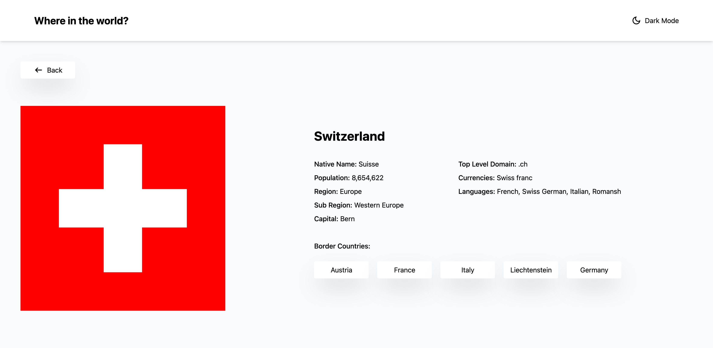

# **REST Countries API with Color Theme Switcher**

This is my solution to the [REST Countries API with color theme switcher challenge on Frontend Mentor](https://www.frontendmentor.io/challenges/rest-countries-api-with-color-theme-switcher-5cacc469fec04111f7b848ca). The challenge required building a dynamic web app that displays detailed information about countries using the REST Countries API. Users can search for countries, filter by region, and toggle between light and dark modes. I built this project from scratch, using the provided screenshot as a reference for the layout and design.

## **Overview**

### **The Challenge**
Users should be able to:

- View all countries fetched from the API on the homepage.
- Search for a country using an input field.
- Filter countries by region.
- Click on a country to view more detailed information on a separate page.
- Navigate to border countries from the country detail page.
- Toggle between light and dark color themes.

## **Screenshot**



## **Links**

- Live Demo: https://where-in-the-world-z7sl.onrender.com (due to limited resources, the app may take up to a minute to start up)
- GitHub Repository: https://github.com/MikeBoguszewski/where-in-the-world

---

# **My Process**

## **Built With**
- **React** - JavaScript library for building dynamic user interfaces.
- **Vite** - Modern, fast build tool to optimize app performance.
- **Tailwind CSS** - Utility-first CSS framework to create a custom, responsive design.
- **REST Countries API** - Used to fetch data about countries.
- **React Router** - For routing between the country list and detailed pages.

## **What I Learned**
This project helped me enhance my React skills, particularly in managing API requests, state, and routing. I also improved my ability to:

- Work with **REST APIs** to retrieve and display dynamic data.
- Use **React Router** to navigate between multiple pages in a React app.
- Implement **state management** for dynamic UI elements, like the theme toggle.
- Utilize **Tailwind CSS** for building responsive, mobile-first designs.
- Handle **asynchronous operations** with JavaScript promises and React hooks.

**Example code snippet (fetching country data):**

```js
const response = await fetch("https://restcountries.com/v3.1/all");
const data = await response.json();

